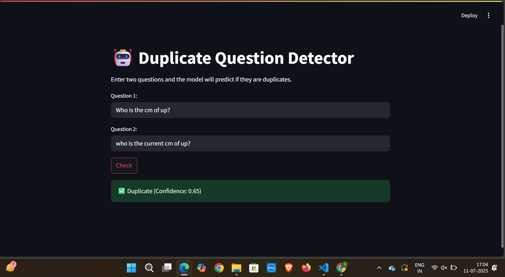

# 🤖 Duplicate Question Detector

A Streamlit-based NLP application that detects whether two input questions are semantically duplicate — inspired by the [Quora Question Pairs](https://www.kaggle.com/c/quora-question-pairs) problem.

## 🚀 Overview

This project uses deep learning (Siamese LSTM architecture) with Keras to classify question pairs as **duplicate** or **not duplicate** based on their semantic similarity.

## 🧠 Features

- Tokenization, lemmatization, and stopword removal using **NLTK**
- Vocabulary building and sequence padding
- Trained using a **Siamese LSTM** model
- Deployed using **Streamlit**
- Prediction confidence displayed
- Google Drive support for dynamic model loading via `gdown`

---

## 🛠️ Tech Stack

- Python
- Pandas, NumPy
- NLTK (for preprocessing)
- TensorFlow / Keras
- scikit-learn
- Streamlit (UI)
- gdown (for model download)

---

---

